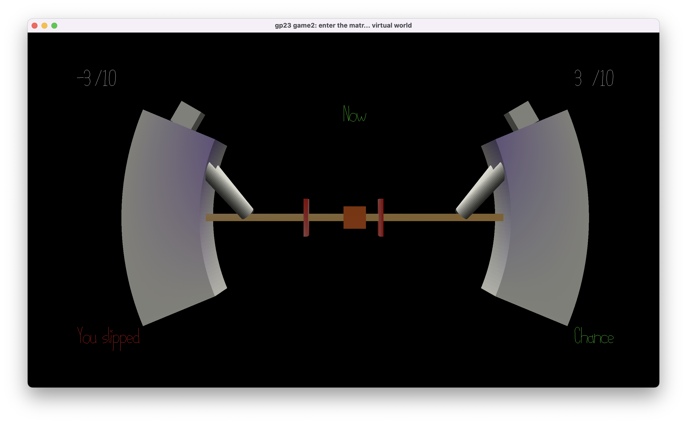

# Tug of war: Strategy Edition

Author: Yile Xu

Design: Tug of war using staff instead of rope, use the "rock paper scissors" strategy to win the battle

Screen Shot:

How To Play:

**LHS**: "A" to pull, "W" to let go, "D" to push  [caution: press and only press 1 button]

**RHS**: "←" to push, "↑" to let go, "→" to pull [caution: press and only press 1 button]

Each time the countdown ends, auto-judge checks the input and moves the staff as follows:

[condition 1: opposite directions or both let go] Nothing happen

[condition 2: someone let go] The staff will move to the other command's direction

[condition 3: same direction] The player who pulls slipped and loses control in the next round

Goal: Same as the tug of war, pull the hook toward the red line at your side

This game was built with [NEST](NEST.md).
I don't know where to cite this but I used Alan Lee (soohyun3)'s commands from the Discord channel https://discord.com/channels/1144815260629479486/1149456290993672273/1150287740114571304